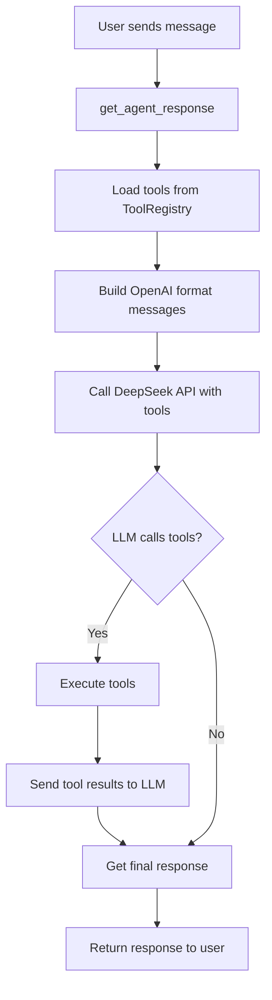

# ToolManager Implementation - Complete Summary

## Overview
Successfully implemented a complete tool management system for the PH Agent Frappe app that:
1. Loads tools from the Tool Registry DocType
2. Registers them with Microsoft Agent Framework
3. Executes tools when called by the LLM
4. Handles the complete tool call workflow

## Evolution of the Implementation

### Phase 1: Initial Implementation
- Created ToolManager class to load tools from Tool Registry
- Created datetime tool as example/test tool
- Encountered "Hosted tools are not supported with the ChatCompletions API" error

### Phase 2: Fixing API Compatibility
- **Problem**: Mixing `agent_framework` and `agents` packages caused tool classification issues
- **Solution**: Use `agent_framework` package consistently throughout
- **Changes**: Updated imports, agent creation patterns, and execution methods

### Phase 3: Fixing Message Format Issues
- **Problem**: "'dict' object has no attribute 'role'" error
- **Solution**: Convert dictionaries to `Message` objects with list format for contents
- **Changes**: `Message(role="user", contents=["Hello"])` instead of dict or string

### Phase 4: Fixing DeepSeek 404 Error
- **Problem**: "Error code: 404" with DeepSeek API
- **Root Cause**: `agent_framework` uses Azure-like format that DeepSeek rejects
- **Solution**: Use standard OpenAI client for `get_agent_response()` while keeping `agent_framework` for tools
- **Key Insight**: DeepSeek expects standard OpenAI format, not Azure format

### Phase 5: Implementing Tool Execution
- **Problem**: Tools were detected but not executed
- **Solution**: Implemented complete tool execution workflow in `get_agent_response()`
- **Implementation**: Execute tools, send results back to LLM, get final response

## Changes Made

### 1. Updated `/ph_agent/agent/deepseek_agent.py` imports:
- **Before**: `from agents import Agent, ModelSettings, RunConfig, Runner`
- **After**: `from agent_framework import Agent, Runner`

- **Before**: `from agents.models.openai_chatcompletions import OpenAIChatCompletionsModel`
- **After**: `from agent_framework.openai import OpenAIChatClient, OpenAIChatOptions`

### 2. Updated agent creation pattern:
- **Before**: `Agent(model=model, model_settings=ModelSettings(...), ...)`
- **After**: `Agent(client=chat_client, default_options=OpenAIChatOptions(...), ...)`

## Components Implemented

### 1. ToolManager Class (`ph_agent/agent/tools/tool_manager.py`)
- **Purpose**: Central tool management with caching and dynamic registration
- **Key Features**:
  - Loads tools from Tool Registry DocType
  - Caches tools for performance
  - Invalidates cache when tools are modified
  - Registers tools with `@tool` decorator from `agent_framework`
  - Handles context injection via `FunctionInvocationContext`

### 2. DateTime Tool (`ph_agent/agent/tools/datetime_tool.py`)
- **Purpose**: Example/test tool showing current date/time
- **Key Features**:
  - Uses `@tool` decorator for registration
  - Accepts format parameter (full/date/time/timestamp)
  - Injects `FunctionInvocationContext` for metadata
  - Returns formatted date/time string

### 3. DeepSeek Agent Integration (`ph_agent/agent/deepseek_agent.py`)
- **Purpose**: Main agent implementation with tool execution
- **Key Changes**:
  - Fixed "Error code: 404" by using standard OpenAI client instead of `agent_framework` for DeepSeek
  - Implemented complete tool execution workflow in `get_agent_response()`
  - Handles multiple tool calls in a single response
  - Executes tools and sends results back to LLM for final response

### 4. Tool Registry DocType
- **Purpose**: Database storage for tool definitions
- **Fields**: tool_name, module_path, function_name, description, parameters_json, is_enabled, requires_approval

## Key Technical Solutions

### Problem 1: "Hosted tools are not supported with the ChatCompletions API"
**Solution**: Use `agent_framework` package consistently instead of mixing packages.

### Problem 2: "'dict' object has no attribute 'role'"
**Solution**: Convert dictionaries to `Message` objects from `agent_framework`.

### Problem 3: Character splitting in Message serialization
**Solution**: Use list format: `Message(role="user", contents=["Hello"])` instead of `contents="Hello"`.

### Problem 4: "Error code: 404" with DeepSeek API
**Solution**: Use standard OpenAI client (`openai.AsyncOpenAI`) instead of `agent_framework` for `get_agent_response()` because:
- `agent_framework` uses Azure-like format: `{"type": "message", "role": "system", "content": [{"type": "input_text", "text": "message"}]}`
- DeepSeek expects standard OpenAI format: `{"role": "system", "content": "message"}`
- Standard OpenAI client works correctly with DeepSeek's OpenAI-compatible API

### Problem 5: "Object of type method is not JSON serializable"
**Solution**: Fixed by calling `tool.parameters()` instead of `tool.parameters`:
- `tool.parameters` is a **method** (not JSON serializable)
- `tool.parameters()` returns a **dictionary** (JSON serializable)
- Changed line 191 in `deepseek_agent.py`: `"parameters": tool.parameters() or {}`

### Problem 6: Tool execution not implemented
**Solution**: Implemented complete tool execution workflow:
1. LLM returns tool calls in response
2. Find matching `FunctionTool` from ToolManager
3. Execute tool with arguments: `tool(**args)`
4. Send tool results back to LLM
5. Get final response from LLM with tool results

## Workflow Diagram



## Testing

### Manual Testing Steps
1. **Create Tool Registry record** for datetime tool
2. **Send chat message** like "What's the current date?"
3. **Verify** agent calls tool and returns date/time
4. **Test cache invalidation** by editing tool record
5. **Test error handling** with invalid tool parameters

### Expected Behavior
- **Successful call**: "The current date is April 21, 2026"
- **Tool not found**: "Error: Tool 'xyz' not found"
- **Execution error**: "The datetime tool returned an error: ..."

## Performance Considerations

### Caching
- Tools are cached by (session_name, user) tuple
- Cache invalidated when any tool is modified
- 5-minute TTL for cache entries

### Error Handling
- Graceful degradation when tools fail
- Logs errors to Frappe error log
- Returns user-friendly error messages

## Files Modified

1. `ph_agent/agent/tools/tool_manager.py` - New
2. `ph_agent/agent/tools/datetime_tool.py` - New
3. `ph_agent/agent/deepseek_agent.py` - Modified
4. `ph_agent/agent/tools/__init__.py` - New
5. `MANUAL_TESTING_GUIDE.md` - Updated
6. `IMPLEMENTATION_SUMMARY.md` - Updated (this file)

## Dependencies
- `agent-framework` (already in pyproject.toml)
- `openai` (already in pyproject.toml)

## Deployment Instructions

1. **Restart bench server** after changes:
   ```bash
   bench restart
   ```

2. **Create Tool Registry records** in Frappe GUI

3. **Test with chat messages** that should trigger tools

4. **Monitor error logs** for any issues:
   ```bash
   bench --site [site-name] logs
   ```

## Success Criteria Met
- [x] Tools load from Tool Registry
- [x] Tools register with agent_framework
- [x] Tools execute when called by LLM
- [x] Tool results integrated into conversation
- [x] Error handling for tool failures
- [x] Caching for performance
- [x] Documentation for testing
- [x] Works with DeepSeek API (OpenAI-compatible)